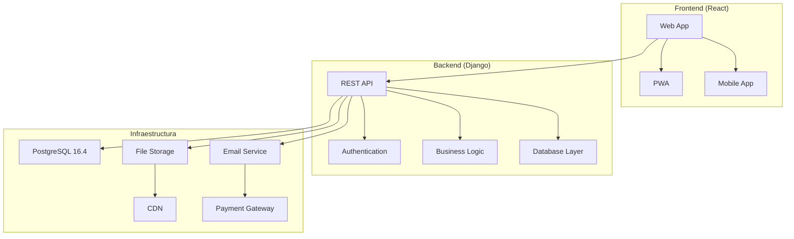

# E-mind

> **Plataforma integral de psicoterapia online que conecta pacientes con psicólogos certificados**

[](./front)
[](./back)
[](https://www.typescriptlang.org/)
[](https://nodejs.org/)
[](https://www.npmjs.com/)
[](https://www.python.org/)
[](https://www.postgresql.org/)
[](LICENSE)
[]()

### Estructura del Backend Detallada

El backend de E-mind está organizado por funcionalidades específicas:

#### **Apps Django Core**
- **`appointments/`** - Gestión completa de citas médicas y sesiones
- **`authentication/`** - Sistema de autenticación JWT y autorización
- **`profiles/`** - Perfiles de usuarios (pacientes, psicólogos, admins)
- **`payments/`** - Procesamiento de pagos y transacciones
- **`schedules/`** - Gestión de horarios y disponibilidad

#### **Apps Django Auxiliares**
- **`comments/`** - Sistema de comentarios y valoraciones
- **`pricing/`** - Gestión de tarifas y precios de servicios
- **`settlements/`** - Liquidaciones financieras entre psicólogos
- **`media/`** - Gestión de archivos multimedia (fotos, videos, documentos)

#### **Configuración y Assets**
- **`backend/`** - Configuración principal del proyecto Django
- **`static/`** - Archivos estáticos (CSS, JS, imágenes)
- **`staticfiles/`** - Archivos estáticos compilados para producción
- **`templates/`** - Plantillas HTML para emails y admin

#### **Archivos de Configuración**
- **`manage.py`** - Script de gestión de Django
- **`requirements.txt`** - Dependencias Python del proyecto
- **`test_*.py`** - Scripts de testing y validación

## 🏥 Acerca del Proyecto

**E-mind** es una plataforma moderna de telemedicina especializada en salud mental que facilita el acceso a servicios de psicoterapia profesional. Nuestra misión es democratizar el acceso a la salud mental a través de tecnología innovadora y profesionales certificados.

### 🎯 Objetivos Principales

- **Accesibilidad**: Eliminar barreras geográficas y temporales para acceder a psicoterapia
- **Calidad**: Garantizar atención profesional con psicólogos verificados y certificados
- **Seguridad**: Proteger la privacidad y confidencialidad de la información del paciente
- **Facilidad**: Proporcionar una experiencia de usuario intuitiva y sin fricciones

---

## 🌟 Características Principales

### Para Pacientes
- ✅ **Búsqueda Inteligente** - Encuentra el psicólogo ideal según tus necesidades
- ✅ **Citas Online** - Agenda y gestiona tus sesiones de forma sencilla
- ✅ **Pagos Seguros** - Sistema de pagos integrado y protegido
- ✅ **Historial Clínico** - Acceso a tu historial de sesiones y progreso
- ✅ **Valoraciones** - Sistema de reseñas para mejorar la calidad del servicio

### Para Psicólogos
- ✅ **Verificación Profesional** - Proceso riguroso de validación de credenciales
- ✅ **Gestión de Agenda** - Herramientas avanzadas para organizar consultas
- ✅ **Dashboard Completo** - Métricas, pacientes y gestión financiera
- ✅ **Herramientas Clínicas** - Notas de sesión y seguimiento de pacientes
- ✅ **Pagos Automatizados** - Sistema transparente de facturación

### Para Administradores
- ✅ **Panel de Control** - Gestión integral de la plataforma
- ✅ **Verificación de Profesionales** - Validación de documentos y credenciales
- ✅ **Moderación de Contenido** - Control de calidad de reseñas y perfiles
- ✅ **Analytics Avanzados** - Métricas de uso y rendimiento de la plataforma
- ✅ **Gestión de Usuarios** - Administración completa de cuentas y permisos

---

## 🏗️ Arquitectura del Sistema



### Tecnologías Core

| Componente | Tecnología | Versión | Propósito |
|------------|------------|---------|-----------|
| **Frontend** | React + TypeScript | 18.2 / 5.3 | Interfaz de usuario moderna |
| **Backend** | Django + Python | 5.1 / 3.12.5 | API REST y lógica de negocio |
| **Base de Datos** | PostgreSQL | 16.4 | Almacenamiento principal |
| **Estado Frontend** | Redux Toolkit | 2.6 | Gestión de estado global |
| **Estilo** | Tailwind CSS | 3.3 | Framework CSS utility-first |
| **Animaciones** | Framer Motion | 12.5 | Animaciones y transiciones |

---

## 📁 Estructura del Repositorio

```
e-mind/
├── 📂 front/                    # Aplicación Frontend (React + TypeScript)
│   ├── 📂 src/
│   │   ├── 📂 components/       # Componentes reutilizables organizados por feature
│   │   ├── 📂 pages/           # Páginas de la aplicación
│   │   ├── 📂 services/        # Servicios y API calls
│   │   ├── 📂 hooks/           # Custom hooks
│   │   ├── 📂 context/         # Contextos de React
│   │   ├── 📂 types/           # Definiciones TypeScript
│   │   └── 📂 utils/           # Utilidades y helpers
│   ├── 📄 package.json
│   ├── 📄 vite.config.ts
│   └── 📄 README.md            # Documentación específica del frontend
├── 📂 back/                     # API Backend (Django + Python)
│   ├── 📂 appointments/        # Gestión de citas médicas
│   ├── 📂 authentication/      # Sistema de autenticación
│   ├── 📂 backend/             # Configuración principal del proyecto
│   ├── 📂 comments/            # Sistema de comentarios
│   ├── 📂 media/               # Archivos multimedia
│   ├── 📂 payments/            # Procesamiento de pagos
│   ├── 📂 pricing/             # Gestión de precios
│   ├── 📂 profiles/            # Perfiles de usuarios
│   ├── 📂 schedules/           # Horarios y disponibilidad
│   ├── 📂 settlements/         # Liquidaciones financieras
│   ├── 📂 static/              # Archivos estáticos
│   ├── 📂 staticfiles/         # Archivos estáticos compilados
│   ├── 📂 templates/           # Plantillas Django
│   ├── 📄 manage.py
│   ├── 📄 requirements.txt
│   └── 📄 README.md            # Documentación específica del backend
├── 📂 .github/                  # GitHub Actions y workflows
├── 📄 .gitignore               # Archivos ignorados por Git
└── 📄 README.md               # Este archivo (documentación principal)
```

---

## 🚀 Inicio Rápido

### Prerequisitos

Asegúrate de tener instalado:

- **Node.js** 20.16.0+ y **npm** 10.8.1+
- **Python** 3.12.5
- **PostgreSQL** 16.4
- **Git** para control de versiones

### Instalación Completa

#### 1. Clonar el Repositorio
```bash
git clone https://github.com/OwensLopez211/PsicologosAPv1/
cd PsicologosAPv1
```

#### 2. Configurar Backend
```bash
cd back

# Crear entorno virtual
python -m venv venv

# Activar entorno virtual
# En Windows:
venv\Scripts\activate
# En macOS/Linux:
source venv/bin/activate

# Instalar dependencias
pip install -r requirements.txt

# Configurar base de datos
python manage.py migrate

# Crear superusuario
python manage.py createsuperuser

# Ejecutar servidor de desarrollo
python manage.py runserver
```

#### 3. Configurar Frontend
```bash
cd front

# Instalar dependencias
npm install

# Copiar archivo de configuración
cp .env.example .env.local

# Ejecutar servidor de desarrollo
npm run dev
```

#### 4. Acceder a la Aplicación
- **Frontend**: http://localhost:5173
- **Backend API**: http://localhost:8000
- **Admin Django**: http://localhost:8000/admin

---

## 🔧 Configuración del Entorno

### Variables de Entorno Principales

#### Backend (`back/.env`)
```env
# Base de datos PostgreSQL 16.4
DATABASE_NAME=emind_db
DATABASE_USER=postgres
DATABASE_PASSWORD=your_password
DATABASE_HOST=localhost
DATABASE_PORT=5432

# Django
SECRET_KEY=your-secret-key-here
DEBUG=True
ALLOWED_HOSTS=localhost,127.0.0.1

# Email
EMAIL_BACKEND=django.core.mail.backends.console.EmailBackend
EMAIL_HOST=smtp.gmail.com
EMAIL_PORT=587
EMAIL_USE_TLS=True
EMAIL_HOST_USER=your-email@gmail.com
EMAIL_HOST_PASSWORD=your-email-password
```

#### Frontend (`front/.env.local`)
```env
# API
VITE_API_BASE_URL=http://localhost:8000
VITE_API_TIMEOUT=30000

# Entorno
VITE_NODE_ENV=development

# Features
VITE_ENABLE_PWA=true
VITE_USE_MOCKS=false

# Desarrollo móvil
VITE_CAPACITOR_ENABLED=false
VITE_EXPOSE_SUBDOMAIN=emind
```

---

## 🧪 Testing y Calidad

### Ejecutar Tests

#### Backend
```bash
cd back

# Activar entorno virtual
source venv/bin/activate  # En Windows: venv\Scripts\activate

# Tests básicos de Django
python manage.py test

# Tests específicos por app
python manage.py test appointments
python manage.py test authentication
python manage.py test profiles

# Tests con coverage (si está instalado)
coverage run manage.py test
coverage report
coverage html  # Genera reporte HTML
```

#### Frontend
```bash
cd front

# Tests unitarios
npm run test

# Tests end-to-end (si están configurados)
npm run test:e2e

# Análisis de código
npm run lint

# Verificación de tipos TypeScript
npm run type-check
```

### Calidad de Código

- **Backend**: Black, isort, flake8, mypy
- **Frontend**: ESLint, Prettier, TypeScript
- **Pre-commit hooks**: Validación automática antes de commits
- **CI/CD**: GitHub Actions para testing automatizado

---

## 📊 Métricas y Monitoreo

### Indicadores Clave (KPIs)

- **Usuarios Activos**: Pacientes y psicólogos registrados
- **Sesiones Completadas**: Número de consultas exitosas
- **Tiempo de Respuesta**: Performance de la API
- **Satisfacción**: Puntuación promedio de valoraciones
- **Conversión**: Ratio de registro a primera cita

### Herramientas de Monitoreo

- **Application Performance**: Sentry para tracking de errores
- **Analytics**: Google Analytics para métricas de uso
- **Uptime**: Monitoreo de disponibilidad del servicio
- **Database**: Monitoring de PostgreSQL y Redis

---

## 🔒 Seguridad y Privacidad

### Medidas de Seguridad Implementadas

- **Autenticación JWT** con refresh tokens
- **Encriptación** de datos sensibles en base de datos
- **HTTPS** obligatorio en producción
- **Validación de entrada** y sanitización de datos
- **Rate limiting** para prevenir abuso de API
- **CORS** configurado apropiadamente

### Cumplimiento Normativo

- **Protección de datos personales** según legislación local
- **Confidencialidad médica** garantizada
- **Auditoría de accesos** y logs de seguridad
- **Backup encriptado** de datos críticos

---

## 📋 Roadmap y Desarrollo

### Versión Actual (v1.0)
- ✅ Sistema de usuarios (pacientes, psicólogos, admin)
- ✅ Gestión de citas y pagos
- ✅ Videollamadas integradas
- ✅ Sistema de valoraciones
- ✅ Panel administrativo

### Próximas Funcionalidades (v1.1)
- 🔄 Chat en tiempo real
- 🔄 Recordatorios automáticos
- 🔄 Integración con calendario externo
- 🔄 Reportes avanzados
- 🔄 App móvil nativa

### Futuro (v2.0)
- 📋 Inteligencia artificial para matching
- 📋 Telemetría de salud mental
- 📋 Grupos de terapia online
- 📋 Integración con wearables
- 📋 Análisis predictivo

---

## 🤝 Contribución

Valoramos las contribuciones de la comunidad. Para contribuir:

### Proceso de Contribución

1. **Fork** el repositorio
2. **Crea** una rama para tu feature (`git checkout -b feature/nueva-funcionalidad`)
3. **Desarrolla** siguiendo nuestras guías de estilo
4. **Escribe tests** para tu código
5. **Commit** tus cambios (`git commit -m 'feat: agregar nueva funcionalidad'`)
6. **Push** a la rama (`git push origin feature/nueva-funcionalidad`)
7. **Abre** un Pull Request

### Guías de Contribución

- Sigue las convenciones de [Conventional Commits](https://www.conventionalcommits.org/)
- Asegúrate de que todos los tests pasen
- Actualiza la documentación si es necesario
- Mantén el código limpio y bien comentado

### Tipos de Contribución Bienvenidas

- 🐛 **Bug fixes**
- ✨ **Nuevas funcionalidades**
- 📝 **Mejoras en documentación**
- 🎨 **Mejoras de UI/UX**
- ⚡ **Optimizaciones de performance**
- 🧪 **Tests adicionales**

---

## 📞 Soporte y Contacto

### Documentación Específica

- 📖 **[Frontend Documentation](./front/README.md)** - Guía completa del desarrollo frontend
- 📖 **[Backend Documentation](./back/README.md)** - Guía completa del desarrollo backend

### Canales de Comunicación

- 🐛 **Issues**: [GitHub Issues](https://github.com/OwensLopez211/PsicologosAPv1/issues)
- 📧 **Email**: dev@emindapp.cl
- 🌐 **Website**: [emindapp.cl](https://emindapp.cl)

### FAQ

**¿Cómo reporto un bug?**
Usa GitHub Issues con la plantilla de bug report.

**¿Puedo solicitar una nueva funcionalidad?**
Sí, usa GitHub Issues con la plantilla de feature request.

**¿Hay documentación para desarrollo?**
Consulta los README específicos de cada módulo.

---

## 📄 Licencia

Este proyecto está licenciado bajo la [Licencia MIT](LICENSE) - consulta el archivo LICENSE para más detalles.

---

## 🙏 Reconocimientos

- **Desarrollador Owens López** - Desarrollo y mantenimiento
- **Comunidad Open Source** - Herramientas y bibliotecas utilizadas
- **Profesionales de la Salud Mental** - Feedback y validación clínica

---

<div align="center">

**[⬆ Volver al inicio](#e-mind)**

╔═══════════════════════════════════════════════════════════╗
║                      E-Mind Backend                       ║
║                                                           ║
║   Author: Owens López                                     ║
║   Email: owenslopez211@gmail.com                          ║
║   GitHub: @OwensLopez211                                  ║
║                                                           ║
║   "Building the future with the power of IA"              ║
╚═══════════════════════════════════════════════════════════╝  

[](./front)
[](./back)

</div>